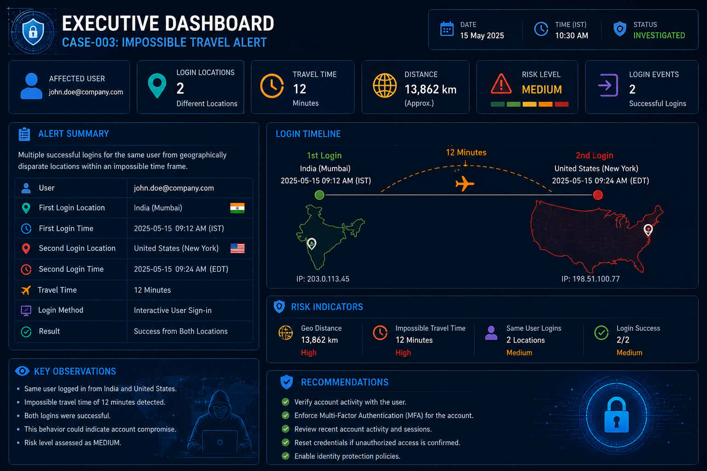
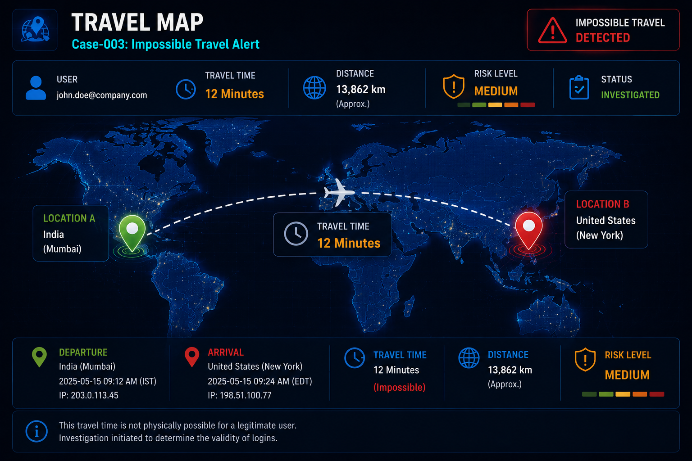

# Case-003: Impossible Travel Login Detection Investigation

## Executive Summary

A user account generated an Impossible Travel alert after successful logins were observed from geographically distant locations within a short period of time.

The Security Operations Center (SOC) initiated an investigation to determine whether the activity indicated account compromise or legitimate user behavior.

The investigation focused on authentication logs, geolocation analysis, user validation, endpoint activity review, and threat intelligence correlation.

Final analysis confirmed that the activity was caused by corporate VPN usage and was classified as a False Positive.

---

## Alert Information

| Field              | Value                      |
| ------------------ | -------------------------- |
| Alert Name         | Impossible Travel Activity |
| Severity           | Medium                     |
| Source             | Microsoft Entra ID         |
| Detection Platform | Microsoft Sentinel         |
| Status             | Closed                     |
| Classification     | False Positive             |

---

## Investigation Timeline

10:00 AM - Successful Login Detected (India)

10:12 AM - Successful Login Detected (United States)

10:15 AM - Impossible Travel Alert Generated

10:20 AM - SOC Investigation Started

10:30 AM - Authentication Logs Reviewed

10:35 AM - User Validation Performed

10:40 AM - Endpoint Activity Checked

10:45 AM - Incident Closed

---

## Alert Description

The user account generated successful authentication events from geographically distant locations within a very short time window.

Traveling physically between the two locations within the observed timeframe was impossible, triggering Microsoft's Impossible Travel detection logic.

---

## IOC Analysis

| IOC Type             | Value                                               |
| -------------------- | --------------------------------------------------- |
| User Account         | [john.doe@company.com](mailto:john.doe@company.com) |
| Source Location      | India                                               |
| Destination Location | United States                                       |
| Time Difference      | 12 Minutes                                          |
| Authentication Type  | Interactive Login                                   |
| Risk Level           | Medium                                              |

---

## Authentication Analysis

### First Login

Location: India

Status: Success

Time: 10:00 AM

---

### Second Login

Location: United States

Status: Success

Time: 10:12 AM

---

### Analyst Observation

A user cannot physically travel from India to the United States within 12 minutes.

This behavior triggered Impossible Travel detection.

---

## Threat Intelligence Review

The source IP addresses were reviewed.

No malicious reputation was identified.

No known command-and-control infrastructure was associated with the IP addresses.

No suspicious indicators were observed.

---

## Endpoint Investigation

The endpoint associated with the account was reviewed.

### Findings

* No malware detected
* No suspicious PowerShell activity
* No unauthorized applications executed
* No persistence mechanisms identified

---

## User Validation

The user was contacted by the SOC team.

The user confirmed active usage of a corporate VPN service during the login period.

VPN exit nodes caused the apparent geographic location mismatch.

---

## MITRE ATT&CK Mapping

### Tactic

Credential Access

### Technique

Valid Accounts

### Technique ID

T1078

---

## Detection Logic

### Detection Objective

Identify successful authentications from geographically distant locations within an impossible travel timeframe.

### Detection Workflow

Successful Login

↓

Location A Detected

↓

Successful Login

↓

Location B Detected

↓

Travel Time Impossible

↓

Generate Alert

---

## Risk Assessment

### Severity

Medium

### Business Impact

Potential account compromise if not validated.

### Likelihood

Low

### Investigation Outcome

False Positive

---

## Response Actions

### Immediate Actions

* Reviewed authentication logs
* Checked endpoint activity
* Verified user identity
* Validated VPN usage

### Long-Term Recommendations

* Improve geolocation filtering
* Enhance UEBA tuning
* Monitor high-risk login activity
* Maintain MFA enforcement

---

## Lessons Learned

* Impossible Travel alerts require contextual investigation.
* VPN usage may generate false positives.
* User validation is critical before escalation.
* Authentication monitoring remains essential for account security.

---

## Final Verdict

Classification: False Positive

Root Cause: Corporate VPN Usage

Severity: Medium

Status: Closed

Investigation Result: No evidence of account compromise identified.

---

---

# Investigation Screenshots

## Executive Dashboard

---

## Travel Map

---

## IOC Analysis

---

## MITRE ATT&CK Mapping

---

## MITRE ATT&CK Mapping

